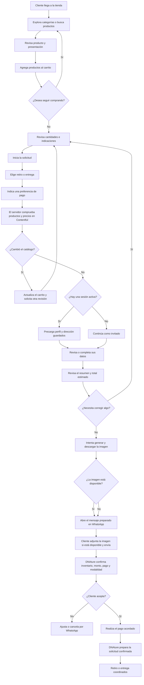

# Flujo de compra asistida de DNAture

Este diagrama describe el comportamiento implementado. DNAture conserva los
patrones habituales de exploración, carrito, checkout y revisión, pero sustituye
el pago y la creación automática del pedido por una coordinación manual en
WhatsApp.

## Límites del sistema

- El carrito no reserva inventario.
- La comprobación de Contentful valida que un producto siga publicado y que el
  precio coincida; no consulta existencias.
- La referencia `DN-…` y la imagen se generan en el navegador; no son un número
  de pedido proveniente de un backend.
- El mensaje de WhatsApp incluye un resumen limitado de productos como
  contingencia si falla la imagen.
- Abrir WhatsApp no adjunta la imagen ni envía el mensaje automáticamente.
- Solo la respuesta de DNAture confirma disponibilidad, monto, pago y entrega.
- El sitio no procesa pagos ni mantiene estados de pedido.
