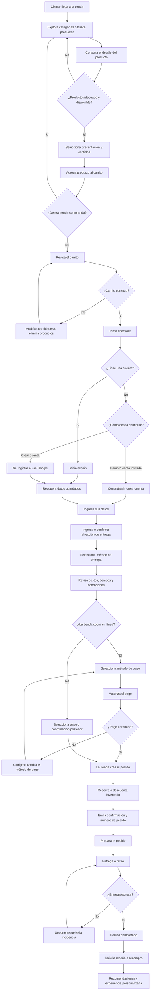

```mermaid
flowchart TD
    A[Cliente llega a la tienda] --> B[Explora categorías o busca productos]
    B --> C[Consulta el detalle del producto]
    C --> D{¿Producto adecuado y disponible?}

    D -- No --> B
    D -- Sí --> E[Selecciona presentación y cantidad]
    E --> F[Agrega producto al carrito]
    F --> G{¿Desea seguir comprando?}

    G -- Sí --> B
    G -- No --> H[Revisa el carrito]

    H --> I{¿Carrito correcto?}
    I -- No --> J[Modifica cantidades o elimina productos]
    J --> H
    I -- Sí --> K[Inicia checkout]

    K --> L{¿Tiene una cuenta?}
    L -- Sí --> M[Inicia sesión]
    L -- No --> N{¿Cómo desea continuar?}
    N -- Compra como invitado --> O[Continúa sin crear cuenta]
    N -- Crear cuenta --> P[Se registra o usa Google]
    M --> Q[Recupera datos guardados]
    P --> Q
    O --> R[Ingresa sus datos]
    Q --> R

    R --> S[Ingresa o confirma dirección de entrega]
    S --> T[Selecciona método de entrega]
    T --> U[Revisa costos, tiempos y condiciones]
    U --> V{¿La tienda cobra en línea?}

    V -- Sí --> W[Selecciona método de pago]
    W --> X[Autoriza el pago]
    X --> Y{¿Pago aprobado?}
    Y -- No --> Z[Corrige o cambia el método de pago]
    Z --> W
    Y -- Sí --> AA[La tienda crea el pedido]

    V -- No --> AB[Selecciona pago o coordinación posterior]
    AB --> AA

    AA --> AC[Reserva o descuenta inventario]
    AC --> AD[Envía confirmación y número de pedido]
    AD --> AE[Prepara el pedido]
    AE --> AF[Entrega o retiro]
    AF --> AG{¿Entrega exitosa?}

    AG -- No --> AH[Soporte resuelve la incidencia]
    AH --> AF
    AG -- Sí --> AI[Pedido completado]

    AI --> AJ[Solicita reseña o recompra]
    AJ --> AK[Recomendaciones y experiencia personalizada]
```