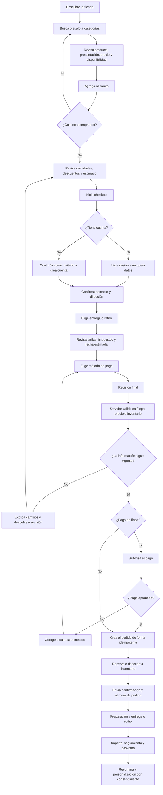

# Flujo de referencia para ecommerce

Este es el recorrido habitual de una compra en línea. Sirve como referencia de
producto; no afirma que DNAture implemente pagos, inventario u órdenes en su
sistema actual. La adaptación vigente está en
[el flujo de compra asistida](./shop-flow.md).
La [exportación SVG ampliada](./shop-flow-diagram.svg) conserva el mapa visual
usado durante el análisis inicial.

## Controles que no se deben omitir

- El servidor vuelve a calcular precios y totales; no confía en `localStorage`.
- La creación del pedido es idempotente para evitar duplicados.
- El inventario se reserva únicamente cuando el sistema puede demostrarlo.
- El pago autorizado y el pedido aceptado son estados distintos.
- Los errores permiten corregir y reintentar sin perder el carrito.
- La confirmación muestra referencia, monto, modalidad y siguiente paso.
- La posventa incluye soporte, cancelaciones, devoluciones y seguimiento según
  la política comercial aprobada.
