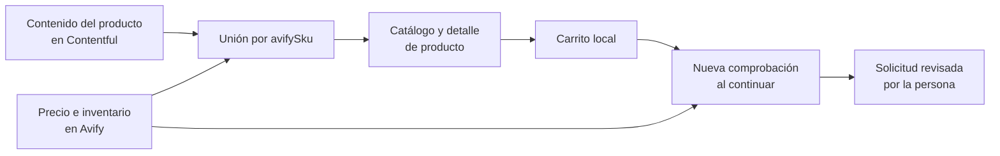

# Guía humana de la integración con Avify

Esta guía explica qué hace Avify dentro del sitio de DNAture sin asumir
conocimientos técnicos. Para detalles de código y operación, consulte
[Implementación de lectura de Avify](./avify-storefront.md).

## La idea en una frase

Contentful presenta el producto; Avify aporta su información comercial actual;
el sitio combina ambos antes de mostrarlos y vuelve a comprobarlos antes de
preparar una solicitud de compra.

## Qué responsabilidad tiene cada sistema

| Sistema | Responsabilidad |
| --- | --- |
| Contentful | Nombre, descripción, fotografías, categoría, URL y contenido editorial. |
| Avify | Precio operativo, precio promocional cuando exista, producto o variante, existencia, reservas y modalidad bajo pedido. |
| Sitio DNAture | Une ambos catálogos, presenta el producto, administra el carrito y calcula el IVA del 13 %. |
| Supabase | Cuentas, perfiles, mascotas, direcciones y carritos guardados; no reemplaza a Avify como sistema comercial. |

Cada producto vinculado guarda en Contentful el `avifySku` del producto padre.
Ese código es la llave compartida. Los nombres no se usan como identidad porque
pueden cambiar o parecerse entre sí.

## Qué ve hoy una persona que compra

- El precio viene de Avify cuando el vínculo es exacto.
- Una presentación usa el precio de su variante de Avify solamente cuando el
  sitio puede identificarla sin ambigüedad.
- “Última unidad disponible” aparece cuando Avify reporta una unidad vendible.
- “Solo quedan X unidades” aparece entre dos y cinco unidades vendibles.
- Cuando hay más de cinco unidades, Avify no expone una cantidad finita o el
  producto se trabaja bajo pedido, no se muestra un mensaje adicional.
- Si Avify reporta cero unidades disponibles, el botón se deshabilita y dice
  “Agotado por ahora”.
- “Disponibilidad por confirmar” significa que falta un vínculo exacto. El
  producto permanece visible, pero comprarlo queda deshabilitado hasta resolver
  esa relación.
- Los precios del catálogo no incluyen IVA. El sitio agrega el 13 % en el
  resumen de compra, de acuerdo con la decisión de DNAture.

El sitio muestra el número únicamente cuando quedan cinco unidades o menos. Las
reservas y los movimientos operativos completos permanecen en Avify.

## Recorrido de la información

La consulta del catálogo se reutiliza por 60 segundos para no sobrecargar a
Avify. Al continuar desde el carrito se hace una consulta nueva: si cambió el
precio, el sitio actualiza el carrito y pide revisarlo; si ya no hay existencia,
retira el producto; si la cantidad solicitada supera la existencia, la reduce y
pide revisarla; si Avify no responde, no continúa con precios antiguos.

## Por qué todavía usamos Contentful en algunos casos

Algunas entradas editoriales tienen varias presentaciones, pero el producto de
Avify vinculado no siempre contiene variantes equivalentes. Elegir un precio de
Avify por parecido podría asignar el valor de otra presentación. En esos casos
el sitio conserva temporalmente el precio editorial, muestra disponibilidad por
confirmar y lo identifica como una brecha pendiente.

Esto es deliberado: una respuesta honesta es preferible a inventar una relación
comercial incorrecta.

## Uso temporal del token de producción

La implementación actual solo contiene consultas de lectura. No crea productos,
no modifica inventario, no crea carritos en Avify y no genera órdenes. El token
permanece exclusivamente en el servidor y nunca se envía al navegador.

Aunque el código sea de lectura, el token de Avify puede tener permisos amplios.
Debe seguir tratándose como secreto, no debe compartirse por chat ni Git y debe
reemplazarse por el token de sandbox tan pronto Avify lo entregue.

## Qué cambia cuando llegue el token de sandbox

Se reemplazan tres valores del ambiente local: endpoint, token e ID de ubicación.
El código de catálogo no debería cambiar. En sandbox podremos:

1. crear datos sintéticos y comprobar variantes sin afectar la operación real;
2. convertir las comprobaciones actuales en pruebas de contrato repetibles;
3. entender los estados de productos padre e hijos con soporte de Avify;
4. preparar el carrito remoto, totales y creación de órdenes de forma segura.

Tener sandbox no autoriza automáticamente las escrituras. Las órdenes solo se
implementarán después de confirmar con Avify sus reglas de idempotencia,
reintentos, métodos de pago, canal de venta y webhooks.

## Glosario corto

- **SKU padre:** identificador generado por Avify para el producto principal.
- **Variante:** presentación concreta, por ejemplo 500 g o 1 kg, con su propio
  SKU, precio e inventario.
- **Ubicación:** bodega o local cuyo inventario se consulta. DNAture usa
  actualmente la ubicación `1815` en producción.
- **Reservado:** unidades apartadas que no deben ofrecerse como disponibles.
- **Bajo pedido (`onDemand`):** producto que Avify permite solicitar sin una
  cantidad física publicada.
- **Fallback:** dato temporal de Contentful que se muestra cuando no existe una
  relación exacta y segura en Avify.

## Cómo saber si algo necesita atención

- Si muchos productos dicen “Disponibilidad por confirmar”, revise los vínculos de
  presentaciones y la configuración de Avify.
- Si el checkout indica que no puede comprobar precios, revise la disponibilidad
  de la API, el token y el ID de ubicación.
- Si un precio parece incorrecto, compare el SKU padre y el SKU de la variante;
  no compare únicamente el nombre.
- Use `/avify-test/` solamente en desarrollo para el diagnóstico completo entre
  catálogos. Esa ruta no está disponible en producción.

## Fuentes oficiales

- [Introducción a la API de Avify](https://avify.com/docs/introduccion-api)
- [Autenticación de Avify](https://avify.com/docs/autenticacion-api)
- [Webhooks de Avify](https://avify.com/docs/webhooks-api)
- [Órdenes V1 de Avify](https://avify.com/docs/ordenes-v1-api)
