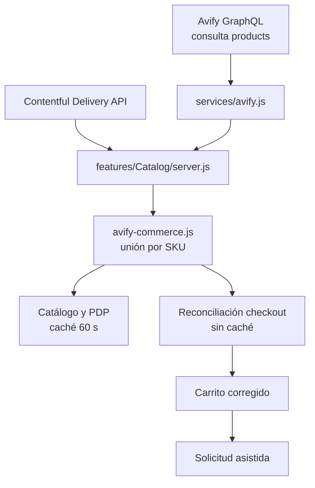

# Implementación de lectura de Avify

Estado: **lectura habilitada; escrituras y órdenes no implementadas**  
Última verificación: **2026-08-11**

## Objetivo

Usar Avify como fuente comercial del catálogo sin exponer su credencial ni
confundir datos editoriales con datos operativos. Esta vertical incorpora
precios e inventario en catálogo, detalle, restauración de carritos guardados y
reconciliación previa al checkout.

## Arquitectura



El navegador nunca llama Avify. `AVIFY_API_KEY`, el endpoint y la ubicación son
valores de servidor. La única operación implementada es la consulta GraphQL
`products`.

## Archivos principales

| Archivo | Función |
| --- | --- |
| `services/avify.js` | Cliente HTTP seguro, validación de respuestas, lotes por SKU, paginación y modelo mínimo. |
| `features/Catalog/lib/avify-commerce.js` | Unión Contentful–Avify, normalización de presentaciones y cálculo de disponibilidad. |
| `features/Catalog/server.js` | Orquestación y caché del storefront; lectura fresca para checkout. |
| `features/Cart/lib/catalog-reconciliation.js` | Revalida identidad, precio, cantidad y disponibilidad antes de continuar. |
| `features/AvifyDiagnostics/` | Reporte local entre catálogos; prioriza el `avifySku` persistido. |
| `contentful/mappings/product-avify-skus.json` | Registro versionado de vínculos aprobados. |

## Contrato de precio

1. `salePrice` se usa cuando Avify devuelve un número; de lo contrario se usa
   `price`.
2. Un producto simple vinculado toma el precio del padre de Avify.
3. Una entrada con presentaciones toma el precio de una variante solo si su
   etiqueta se resuelve de manera única mediante nombre, atributo u opción de
   variante.
4. Una relación ausente o ambigua conserva el precio de Contentful y se marca
   `contentful-fallback`; no se presenta como confirmación de Avify.
5. Los precios son netos. El carrito calcula `Math.round(subtotal * 0.13)` y
   agrega el IVA como línea separada. Avify reporta actualmente impuesto `0` y
   ese valor no reemplaza la regla comercial aprobada por DNAture.

## Contrato de inventario

La ubicación se envía como `locationId`. Para cada producto o variante:

```text
si onDemand = true  → available
si qty no es número → unknown
si max(qty - reserved, 0) > 0 → available
en otro caso → unavailable
```

No se usa todavía `status` para decidir venta: en la cuenta actual los productos
padre pueden aparecer inactivos mientras sus variantes están activas. Avify debe
confirmar esa semántica antes de convertirla en una regla.

No se expone `availableQuantity` al cliente. Se conserva dentro del modelo de
comercio para diagnóstico y decisiones futuras.

## Fallos y consistencia

- Catálogo/PDP: si Avify falla, el sitio puede renderizar contenido y precio de
  respaldo con disponibilidad por confirmar.
- Checkout y restauración de carrito: si Avify falla para un producto vinculado,
  la operación se detiene; no se acepta un precio potencialmente antiguo.
- SKU persistido que Avify ya no devuelve: el producto se retira durante la
  reconciliación y el diagnóstico lo marca como vínculo roto.
- Precio modificado: se actualiza y se exige una nueva revisión de la persona.
- Cantidad mayor a la existencia utilizable: se reduce al máximo disponible y
  se exige una nueva revisión.
- Variante sin existencia: se retira antes de preparar la solicitud.
- Más de 50 líneas o cantidades fuera de 1–99: se rechazan como entrada no
  confiable.

La carga del storefront usa una caché de 60 segundos. La acción de checkout y la
restauración de un carrito guardado solicitan datos frescos con `cache:
"no-store"`.

## Configuración

```dotenv
# Servidor únicamente; nunca usar NEXT_PUBLIC_.
AVIFY_API_KEY=
AVIFY_GRAPHQL_URL=https://api.avify.com/graphql
AVIFY_LOCATION_ID=1815
```

El ID `1815` corresponde a la ubicación de producción verificada para DNAture.
Cuando llegue sandbox, use:

```dotenv
AVIFY_API_KEY=<token-de-sandbox>
AVIFY_GRAPHQL_URL=https://sandboxapi.avify.co/graphql
AVIFY_LOCATION_ID=<id-de-ubicacion-en-sandbox>
```

El ID de producción no debe copiarse a sandbox sin consultar primero la lista
de ubicaciones de ese ambiente.

## Evidencia de la verificación de lectura

El 2026-08-11 se ejecutaron consultas de solo lectura contra producción:

- los 92 SKU padre aprobados fueron solicitados y los 92 regresaron;
- 82 se reportaron como simples y 10 como configurables en esa lectura;
- `salePrice` fue nulo y nunca `0` en los padres y variantes recibidos;
- 35 padres y una variante reportaron existencia utilizable cero;
- Avify aceptó `taxPrice`, `taxPercentage`, `reserved`, `onDemand`, atributos y
  opciones tanto en el modelo consultado como en las variantes aplicables.

Estos números son una fotografía operativa, no constantes ni expectativas de
prueba. El catálogo cambia y debe consultarse de nuevo para decisiones actuales.

## Pruebas

```bash
npm test -- --run tests/unit/avify-service.test.js
npm test -- --run tests/unit/avify-commerce.test.js
npm test -- --run tests/unit/cart-catalog-reconciliation.test.js
npm run check:architecture
```

Las pruebas cubren respuesta segura, paginación incompleta, lotes y ubicación,
precio simple, variantes, reservas, `onDemand`, etiquetas ambiguas, API caída,
vínculos rotos y reconciliación del carrito.

## Brechas antes de órdenes reales

1. Recibir el token y una ubicación de sandbox.
2. Confirmar con Avify el significado de estados padre/hijo y la política de
   productos bajo pedido.
3. Aprobar vínculos exactos para todas las presentaciones que hoy usan fallback.
4. Configurar en Avify el impuesto del 13 % o confirmar por escrito que el sitio
   debe enviarlo/calcularlo fuera de Avify.
5. Confirmar método de envío de ₡3.500, métodos de pago y canal de venta.
6. Obtener reglas de límites, errores reintentables e idempotencia de
   `createOrder`.
7. Implementar en sandbox el flujo remoto: ubicación → métodos de pago → carrito
   → totales → orden pendiente.
8. Definir autenticación, reintentos, orden y deduplicación de webhooks.

No se debe implementar una mutación con el token de producción actual.
